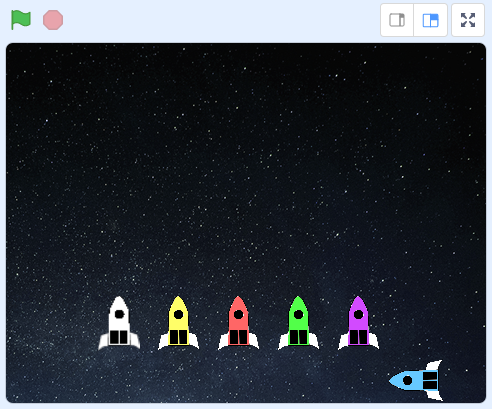
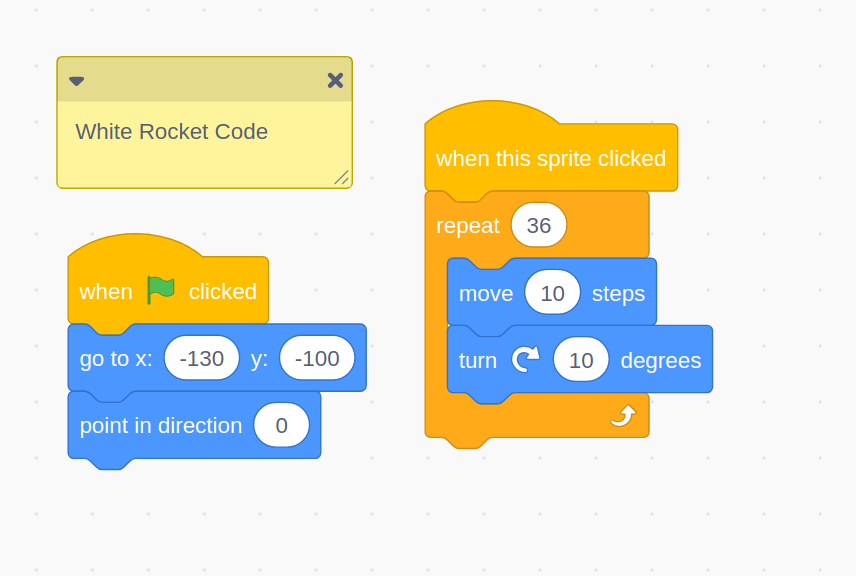
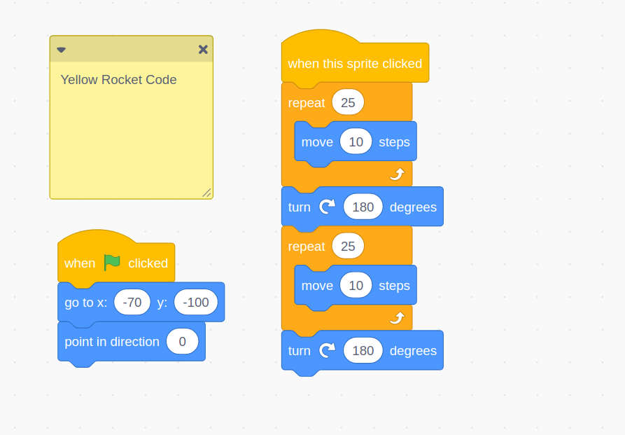
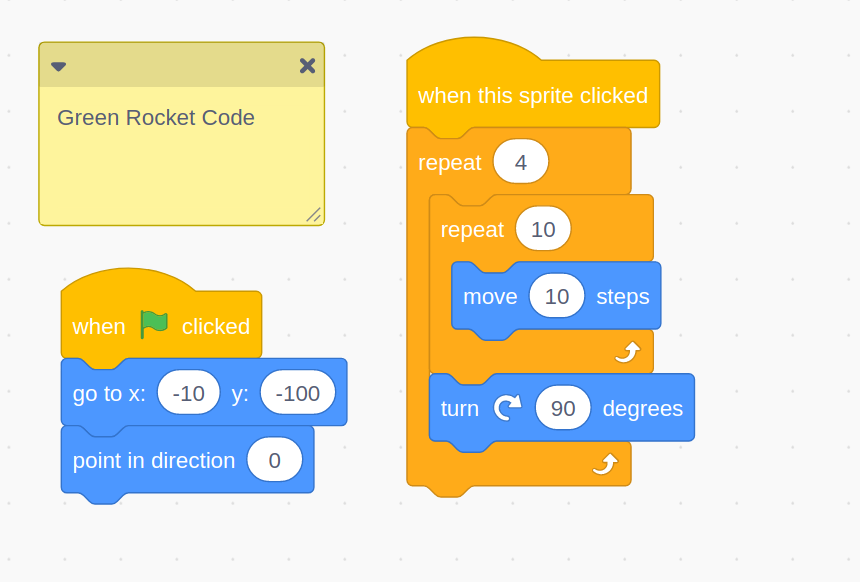
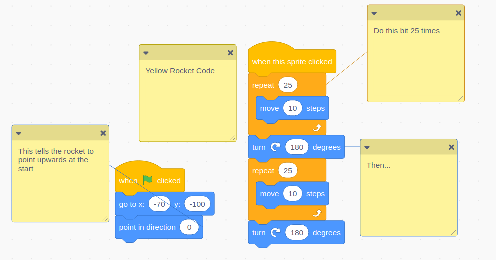


{{title}}


In _Rocket Trips_, children create animations of different different sprites (rockets in the example code, but children can use any sprites), which they will get to move around a variety of, hopefully elaborate, paths.

This project allows children to build on their work with **sequencing** instructions in their code, using more advanced **repetition** and **iteration** (i.e. using loops that repeat). Children will only have had a very brief introduction to loops in year 3 (in code that repeats a certain number of times), so most of this will be new to them.

> Computers don't get bored, and are very accurate (as long as they are programmed accurately...). Because of this, loops are used _everywhere_ in computer programs. Humans get fed up if they have to do the same repetitive tasks over and over, but computers don't, and, humans make mistakes with these kinds of tasks. Right now, the code running on the device you're reading this on is looping through the thousands (or millions) of pixels on screen, keeping them updated to the right colours, many times a second.

This project assumes a basic level of Scratch knowledge, such as how to create sprites and add code to them, how to create backgrounds, and how to load, save, and (if using Scratch accounts) remix projects shared via a studio. If children are saving work locally to their computers, then there will need to be a way to share a Scratch project with them.

### Suggested Session Breakdown

The outline below is a very rough guide, and depends on learners being comfortable with logging in to Scratch, creating, saving programs, and using a class studio to find, remix and share projects.

| Session | Suggested Outline                                                                                                                                                                                                       |
| ------- | ----------------------------------------------------------------------------------------------------------------------------------------------------------------------------------------------------------------------- |
| 1       | Showing the code for white, yellow and green rockets, and [predicting](#predict) what they do; [running](#run) the project; paired work on commenting the code - predicting and running will need to run work in tandem |
| 2       | [Investigate](#investigate) and [modify](#modify) session - children explore changing values the code for themselves                                                                                                    |
| 3       | Beginning to [make](#make) our own animations; designing and pseudo-coding on paper; shared coding inputs/plenaries one using `repeat` to animate paths                                                                 |
| 4       | Continued [making](#make); adding animations to class studios; sharing and peer-reviewing work; making improvements                                                                                                     |

## Predict

Children should first have an opportunity to read the code, and should be reminded that it can be read like a story, one line at a time, and it should make sense. This is even more important with some of the more advanced parts of this project, which involve multiple nested loops, and therefore require some concentration to read.

There isn't much to see from the background of the project:



However, there is lots to discuss about the code. Give children a copy of the first rocket's code (the white rocket), and allow them time to think about and discuss with partners what they predict it will do.



Discuss what this code says:

- What happens when the flag is clicked?
- What code block is being used to make a loop?
- How many times does the loop happen?
- What is happening in the loop?

Very able mathematicians might be able to predict that, because there are 360&deg; in circle, the rocket turns by 10&deg; each time, and the loop repeats 36 times, then it will travel in a circle. However, this is not Year 4 maths, and is likely to confuse children if they don't notice this for themselves. Children might also notice this later in the project when they are running or investigating the code.

Repeat this process for the yellow and green rockets.



Discuss with the children what they think this rocket will do when we run the code (i.e. click it). How will it move? It can be useful to discuss what the code would look like _without_ the loops. What would the white rocket's code look like? There would be 36 `turn` and `move` blocks. The whole stack would be 73 blocks high. How many blocks does the actual code use? Why is this better? What would happen if you tried this without loops? What if you lost count? (In the "investigate" phase, children can have a go at making these without loops.)



Discuss the code for the green rocket - draw attention to the fact there is a loop inside a loop. Step through this code and think about what it does. Children should notice:

- it's doing something 4 times
- on each of those times, it's doing something (moving forward)
- it turns 90 degrees - children should know what kind of turn this is (and hopefully work out how the rocket will travel)

## Run

Now it's time for children to run the code themselves. We haven't discussed the code for the red, purple or blue rockets, so explain to children that these are a little bit more advanced, but they can still by all means play with these. They might want to make code like this later in the project.

<iframe src="https://scratch.mit.edu/projects/389381414/embed" allowtransparency="true" width="485" height="402" frameborder="0" scrolling="no" allowfullscreen></iframe>

Were their predictions correct? If not, can they see how the rockets' movements are animated?

Next, children should **comment** the code. Assuming they have logged in to their scratch accounts, they should create a remix of the project, rename it (as something like "Rocket Trips Commented") and work from this.

Commenting code is a vitally important skill - it lets other programmers know what you were thinking when you made the code, and lets them see why your code is written the way it is. Even more important, it helps your memory. As your programs get bigger and more complicated, you might not remember what each piece of code is doing when you come back to it next week, or even later in the same lesson. So, getting children used to the idea of writing comments on their code is really useful.

Children should write comments on the code to explain what each part does, paying particular attention to where the variables are being used. As with any writing, children may need support for this, such as scribes, or working with a partner to record their ideas. For example:



> Comments can be added by right clicking. Right clicking on the empty white "canvas", and choose "add comment", this adds a general comment. Right clicking on a specific block and choosing "add comment" add a comment with a red line pointing to that block.

## Investigate

Now it's time for children to investigate the code in greater depth, by answering questions about it, and by generating their own. This can be done individually, or in pairs, but pairs should probably be of similar ability, as less able learners may not learn about how the code works if a more able peer simply tells them things. Some questions could include:

- Can they see where new ideas are being used? (In this project, loops that repeat a given number of times.)
- Can they see where inputs are being used? (Here, there are only `click` events on flags.)
- Can they see where concepts they have learned before are being used, such as sequencing?
- Can they explain how the flow of the program is being controlled? (i.e. with `repeat` blocks)
- Can they explain how the program is initialised, so that it runs the same each time?

## Modify

Children should explore the code by changing things. As above, they should work from a remix of the project, and as always, should be encouraged to break things. Nothing can really go wrong; the worst that can happen is they have to get another copy of the original project. In this project this is even more the case than normal. The code for each rocket is laden with numbers that can have a huge effect on the animation.

For example, look at the code for the green rocket, which draws a square:


Children could explore:

- what happens if the number in the `repeat 4` block is changed?
- what about the `repeat 10`?
- what about the number of degrees?

If they compare this to the purple rocket, which draws a triangle, what is the same and what is different? What happens if they change the numbers here? What do they notice is the same and different between the two loops? The outer `repeat` block is 3 for the triangle, and 4 for the square, and controls the number of sides to the shape. The angle that the rocket turns through is 120 degrees for the triangle and 90 for the square. Children in year 4 are unlikely to notice that this angle is 360/number of sides, and therefore any polygon can be drawn this way. But children can be guided to try

```
repeat 6
  repeat 5
    move 10 steps
  turn 60 degrees
```

Or

```
repeat 5
  repeat 6
    move 10
  turn 72 degrees
```

Class discussion can follow a similar path for the red rocket, and how curved paths are created.

It's worth mentioning that children will only get so far replacing numbers randomly. They will need guidance and discussion to understand the impact their changes are having on the animations.

## Make

Finally, it's time for children to make their own animations. This will likely take a few lessons, and involve some trial and error, so children should be signed into their Scratch accounts and have named and saved their project before they start work.

These session could begin with shared inputs on making a sprite move in a particular way, for example in a square, hexagon or triangle. It is easiest to iterate on this process in steps, i.e. by making a sprite move in a square in one `repeat` loop, then adding an outer `repeat` loop to make the whole square happen more than once.

There is no reason children's animations should involve rockets. They could create animal animations around a habitat, boats on a river, people around a town, or anything that fits with the class' current topic.

Before coding anything, children should plan their work on paper.

- What will it look like?
- What vehicles/characters will be animated?
- What paths will they take?
- How will these paths use repitition? (Remember that this is our objective)

Children should focus on ONE animated path at a time - trying to create too many will result in none of them being finished to a high standard. It's far better to have one animated path working well that have six sprites that are all broken.

Childern should write notes in "psuedo-code" to show roughly how their algorithm for their desired path will work. For example, to draw a triangle right then left:

```
repeat 3
  repeat 5
    move 10 steps
  turn 120 degrees
turn 60
repeat 3
  repeat 5
    move 10 steps
  turn 120 degrees
```

This specific block of pseudo code is not perfect and probably won't work exactly right, but that's not important, as numbers can be tweaked as we're testing our code. What **is** important is that children have thought about the overall structure of what they're trying to achieve before they start putting blocks together.

As always, allow ample time for children to iterate on their code, to share it with their peers, to evaluate each others' work and improve their own animations.

> **A note on curved motion** - describing curved motion can be tricky. There is a certain amount that can be done with the `rotate _ degrees` and `move _ steps` blocks, as shown in the original project. But this technique only goes so far, and more complex motion eventually needs trigonometry. Depending what children what to create, it's probably worth guiding them towards straight line motion, as this is often a lot simpler.
