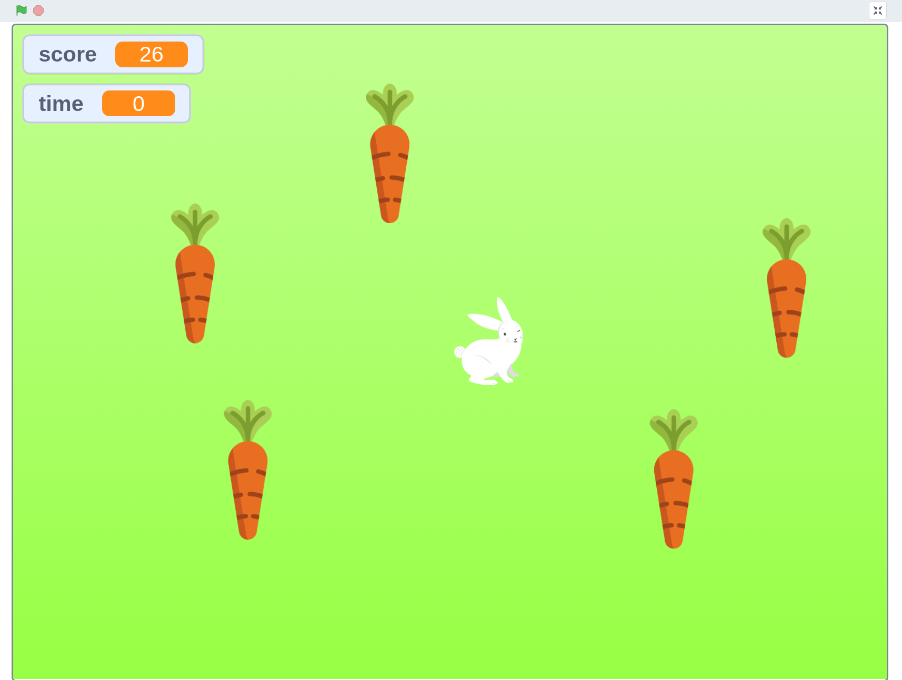
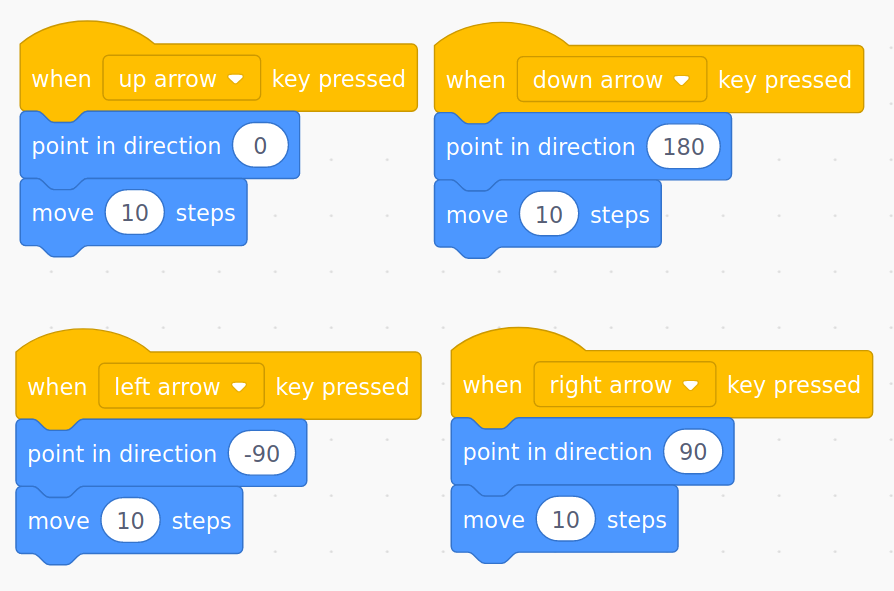
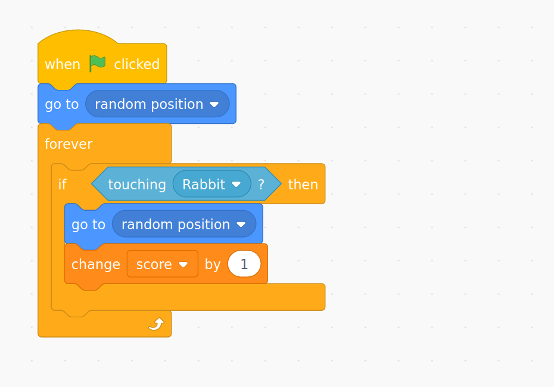
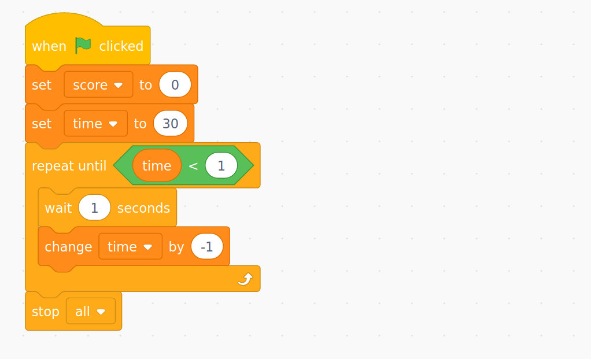
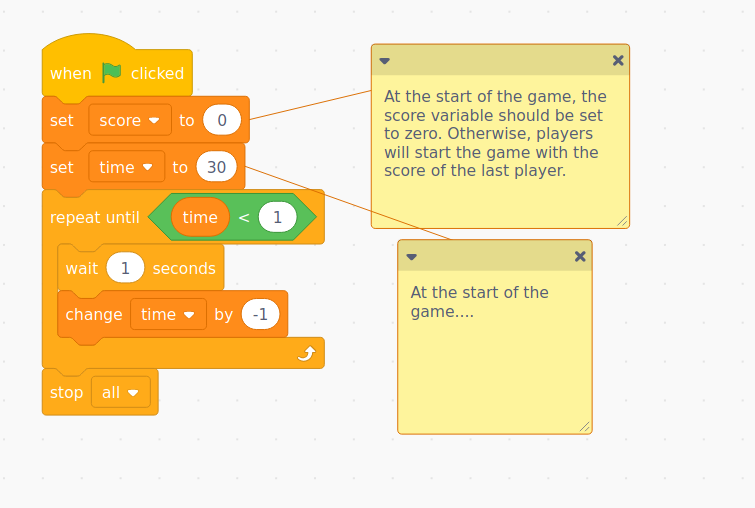
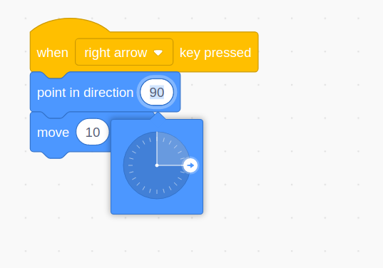

# {{title}}

### Downloadable Resources

- [Carrot Collector Scratch Project](./resources/carrot-collector.sb3)
- [Code sheets for Children](#)

In this project, children will make a simple game called Carrot Collector. The rabbit needs to collect as many carrots as possible before the time runs out. They get one point for each carrot - who can get the highest score?

In this project, children will be introduced to **variables**, which are used to keep track of how many carrots they have collected (their score) and the time remaining, in seconds.

This project assumes a basic level of Scratch knowledge, such as how to create sprites and add code to them, how to create backgrounds, and how to load, save, and (if using Scratch accounts) remix projects shared via a studio. If children are saving work locally to their computers, then there will need to be a way to share a Scratch project with them.

## 1. Predict

First, children should have the opportunity to read the code. Remind children that code can be read as a story, they can step through it logically, one block at a time, and read it out loud. If they do this, it will almost always make sense.

First, the game itself looks like this - can anyone predict how it works or what the idea is?



Now, look at the code - how does the rabbit move? Note that children may not be familiar with 180&deg; (although they should know 90&deg; and the concept of a right angle from Year 2 maths)



Next, look at the carrots. What is their code doing? Draw particular attention to the nested block of `forever` and `if`. This is a loop that keeps running continuously to see **if** the rabbit is touching the carrot. Forgetting to put the `forever` around the outside of the `if` is common error in this type of code; without the `forever`, the code will just run **once**, at the start of the game (when the flag is clicked), and never again.



And finally, have a look at the timer code.



Discuss with the children, or in partners/groups, what they think will happen when we run the code (i.e. click the green flag).

This may well be the first time children have worked with variables, and this will require a lot of discussion and reinforcement in this (and subsequent) projects, but it is _vital_ that they understand where variables are being used in this program, how they are used, and why.

> Variables are used by programmers to store useful information, called **data** that their program needs to rememeber, such as the score in a game. Without them, the program cannot remember anything. Variables are like boxes that store information. As a programmer, you can make your own variables, store things in them, like words or numbers, then later look up what is stored there, and change it if you need to. Programmers give their variables useful names, such as "score" for a variable that stores the score in a game, or "lives" for a variable that keeps track of a player's remaining lives.

The first variable they can see in this project is in the carrot code: a block of code there says `if touching rabbit, go to random position, change score by 1`. Some key questions for children:

- What is the variable called here?
- What happens to this variable in this code?
- Look at the rest of the code - where else can you see this variable being used?
- Why is this varible used in these two places?

Discuss other places variables might be used in programs. Can anyone see another one here? (There's one called `time`.) Other variables might be used in games for things like what level you are on, or how much money you have in a game. When you log in to a website, they are used to store things like your username, who you are friends with, your messages, and many, many more things. They are **everywhere**.

## 2. Run

Now, children can run and play the game. Intially, just allow them to play.

<iframe src="https://scratch.mit.edu/projects/394908164/embed" allowtransparency="true" width="485" height="402" frameborder="0" scrolling="no" allowfullscreen></iframe>

Next, children should **comment** the code. Assuming they have logged in to their scratch accounts, they should create a remix of the project, rename it (as something like "Carrot Collector Commented") and work from this.

Commenting code is a vitally important skill - it lets other programmers know what you were thinking when you made the code, and lets them see why your code is written the way it is. Even more important, it helps your memory. As your programs get bigger and more complicated, you might not remember what each piece of code is doing when you come back to it next week, or even later in the same lesson. So, getting children used to the idea of writing comments on their code is really useful.

Children should write comments on the code to explain what each part does, paying particular attention to where the variables are being used. As with any writing, children may need support for this, such as scribes, or working with a partner to record their ideas. For example:



> Comments can be added by right clicking. Right clicking on the empty white "canvas", and choose "add comment", this adds a general comment. Right clicking on a specific block and choosing "add comment" add a commet with a red line pointing to that block.

## 3. Investigate

Now it's time for children to explore the code, by changing it. Again, they should work from a a "remix" of the original code, and they should focus on the use of variables.

First, they can explore changing whatever numbers they like, running the code, and seeing what happens. Then, they should be a little more "focused" in the changes they make. For example:

- Can children make the rabbit move faster or slower?
- Can children make the game last longer? Or less time?
- Can children make certain carrots worth more points than others? If children need hints with this, then:
  - If a carrot is work 5 points, what would happen what would need to change?
  - Where is this change located in the code?
  - How will the player know that some carrots are different? Could they be a different colour? A different size? Should carrots that are worth more points be larger or smaller?
- Can children make some carrots "poisonous" - i.e. if you collect them, then you _lose_ points? Think about the above points for this change.

## 4. Make

For the final part of this project, children should make their own version of Carrot Collector. The exact topic of children's games will vary. These could be open, or could be linked to class topic work. For example:

- a pirate collecting different treasures (where different items are worth different numbers of points)
- a character collecting different foods, where healthy foods increase score, and unhealthy ones decrease it
- an ancient Greek hero collecting artefacts from different myths that children have studied

First, they will need to plan their idea around the basic outline of the game.

- What character will the player control?
- What will they be collecting?
- How long will the game run for?

Additionally, children could (should?) extend their plan to include:

- Will certain items be worth more points than others?
- Will certain items cause the player to lose points?

These plans should be carried out on paper first, and children should be encouraged to write out their algorithms with "psuedo-code" notes. For example:

```
when the green flag is clicked
set the score to zero
set the timer to 30 seconds
until time < 1
wait 1 second
take away 1 second
```

Or

```
forever
if pirate is touching treasure
make treasure go to random position
increase score by 10
```

Once children have planned their work, the only thing left is for them to implement it. If they have followed the steps up until now, it shouldn't be hard for them to create a simple version of their game, to which they can then add things like items which cause a player to lose points.

As noted above, children may not be familiar with 180&deg; (although they should know 90&deg; and the concept of a right angle from Year 2 maths), may need the idea of "-90&deg;" explained. The Scratch interface allows users to choose the direction they want visually by clicking the input for degrees, and children generally find this quite intuitive:



### Creating Variables

There are some parts that may catch children out. As variables are new, they will need to be taught how to make make them - the blocks for this are **dark orange**, and new variables can be made using the "make a variable" button. The window that pops up will ask them to give their new variable a name, which can be anything, but should be meaningful (i.e. "score", not "my nice variable"). There is also a choice between "for all sprites" or "for this sprite only". For this project, children should only need "for all sprites", which allows all sprites in the project to access the variable. If children are having problems later in their code because they don't have the variables they need, even though they created them, then it might be because they chose "for this sprite only", which means other sprites cannot access the variable.

> The difference between **local** and **global** variables will become more important as children progress. Local variables are those that are only accessible to "this sprite only", whereas "global" variables are accessible to all sprites. For example, imagine a game with two players. Both might have the same code, and a variable called "score", but these would need to be kept separate, and therefore would be created "for this sprite only", so that updating one player's score doesn't update the other. In this project, variables need to be "for all sprites" so that, for example, **all** the carrots can update the player's score.

### Timers

Children can copy the timer code as is for their own project. A class discussion of how it works is likely to be useful, but it uses a **condition** (i.e. `time < 1`) to check whether the time has run out. This is a structure that children will cover in more detail in later projects, so don't give too much time to it here.

Finally, children should be reminded to save their work often, use the original game and their plan for support, and take regular breaks to share their code with their friends and play each others' games as they develop.

And, always leave plenty of time for children to play their finished games, share them in a class studio (if you are using these), and enjoy themselves.
