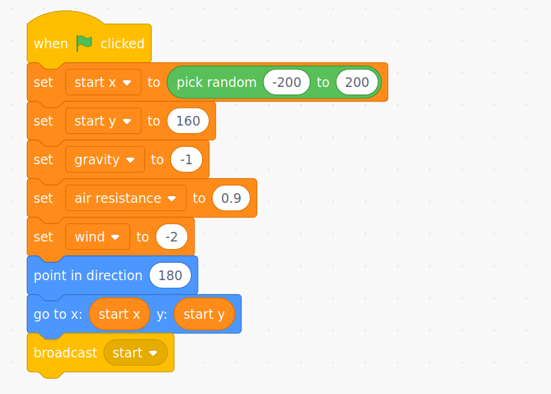
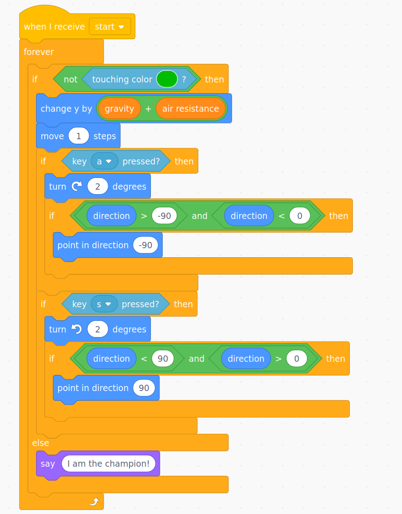
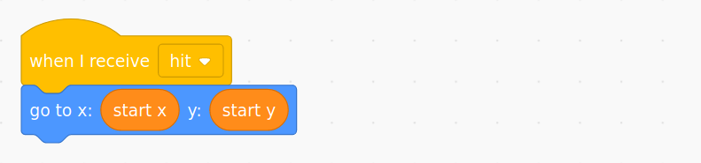
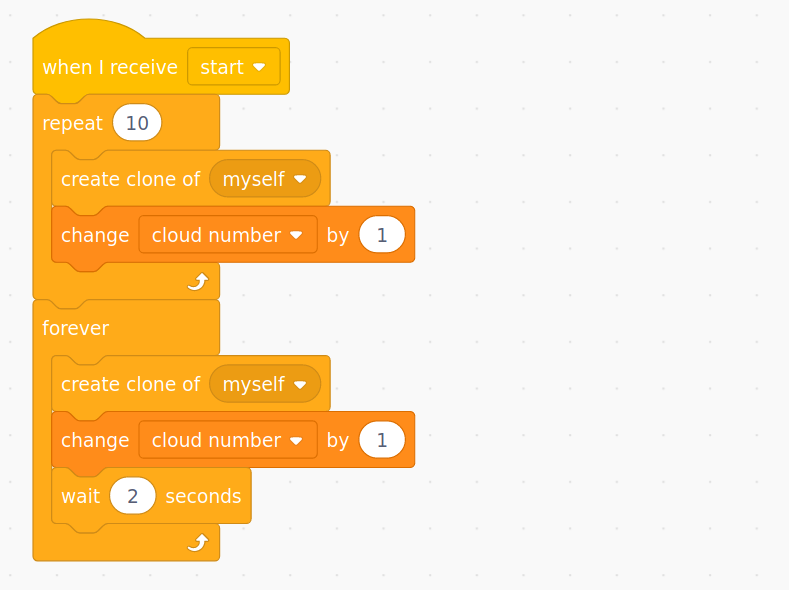
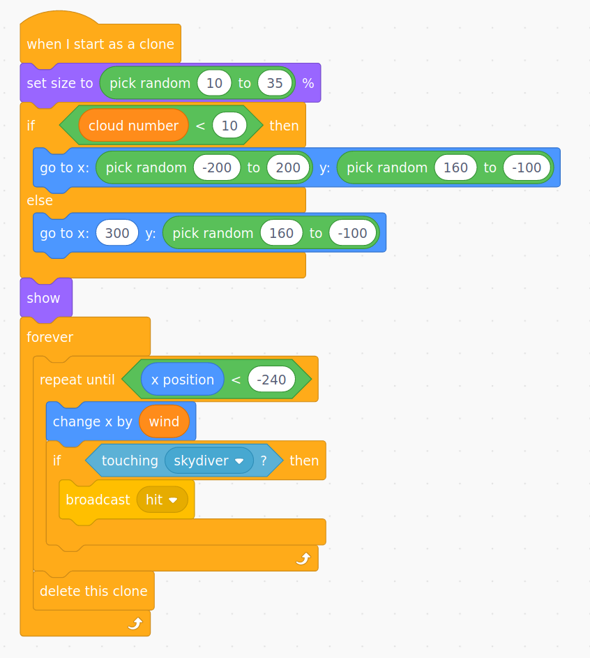

# {{title}}

### Downloadable Resources

- [Parachute Scratch Project](#)
- [Code sheets for Children](#)

In this project, children will make a game called Parachute Drop. The skydiver needs to get to the ground without hitting any of the clouds.

Children will review prior work on **variables**, and begin to explore how physical systems can be modelled in code. The variables are use here to model forces such as the air resistance and gravity, which act on the clouds and the skydiver. This project fits best with **work in science on forces**, and a science investigation into parachutes.

They will continue to use **selection** and will explore other ways that it is used, for example with **inputs** (i.e. `if key a is pressed then`), and begin to use it with **iteration** to position the clouds at the start of the game.

This project assumes a level of Scratch knowledge that builds on the knowledge covered in the Year 4 project, including how to create sprites and add code to them, how to create backgrounds, and how to load, save, and (if using Scratch accounts) remix projects shared via a studio. If children are saving work locally to their computers, then there will need to be a way to share a Scratch project with them.

## 1. Predict

First, children should have the opportunity to read the code. Remind children that code can be read as a story, they can step through it logically, one block at a time, and read it out loud. If they do this, it will almost always make sense.

First, the game itself looks like this - can anyone predict how it works or what the idea is?

Now, read and discuss the first part of the code.

This is the setup for the skydiver. What variables are set here? Look at the use of a `broadcast` block. Why is this here? (It broadcasts a message called "start" once the initial setup of the variables is completed. This message can the be received by the various sprites in the game. This is a common pattern that is used to ensure things like gravity, timers, lives, positions, etc are definitely set before sprites start to use them.)

> Children may not have seen the combination of blocks `broadcast` and `when I recieve` before, and this pattern may need to be taught. These two blocks are used to send messages between sprites, for example, if the clouds here touch the skydiver, they broadcast a message which is received by the skydiver and returns him to his start position. Without this, the skydiver's code would have to check every single cloud one by one to see if he had hit them.

Next we have the code for controlling the skydiver. This should be more familiar to the children as it consists of nested `forever` and `if` blocks. Again, children should read and discuss this code, and speculate on what it does. Children should be comfortable with the way the key inputs are working to rotate the skydiver.

They should note the use of the `when I receive "start"` block at the top; this code will start running once everything is set up. Also, they should realise that the if block is checking to see if they are _not_ touching the ground (the green colour), and then moving the skydiver in this case (i.e. if the skydiver _is_ touching the ground, then he will stop moving and say "I am the champion!").

A subtle part of this code is the blue `move 1 steps` block. This is moving the skydiver in the direction the sprite is facing. Note the the sprite's costume is drawn rotated through 90&deg; and the setup code points the sprite in the direction 180&deg;. This is what allows the skydiver to fall with a combination of gravity and the direction he is pointing. Then, when a key is pressed to turn the sprite, an `if` block also checks whether the sprite is rotated outside of the range -90&deg; to +90&deg;, as the skydiver shouldn't be able to go up! This part is a bit tricky to understand, and it would be fine for children to just copy the blocks `if direction > -90 and direction < 0` and `if direction <90 and direction > 0`.

The final piece of code for the skydiver is simple, but children should discuss where the the "hit" message might be coming from. They should also notice that the original location of the skydiver was stored in the variables "start x" and "start y" in the set up code, so that he can be returned to the same start location if he hits a cloud.

