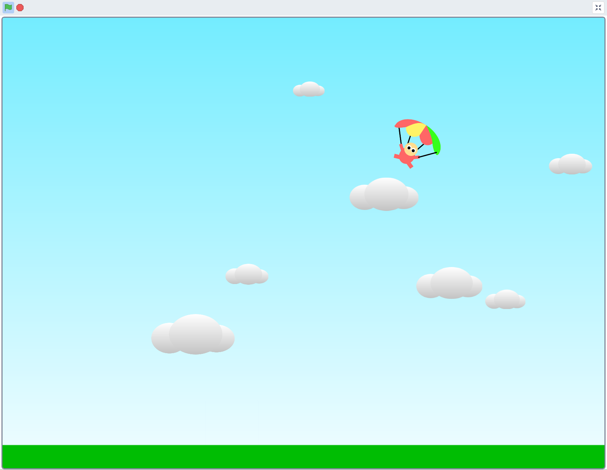
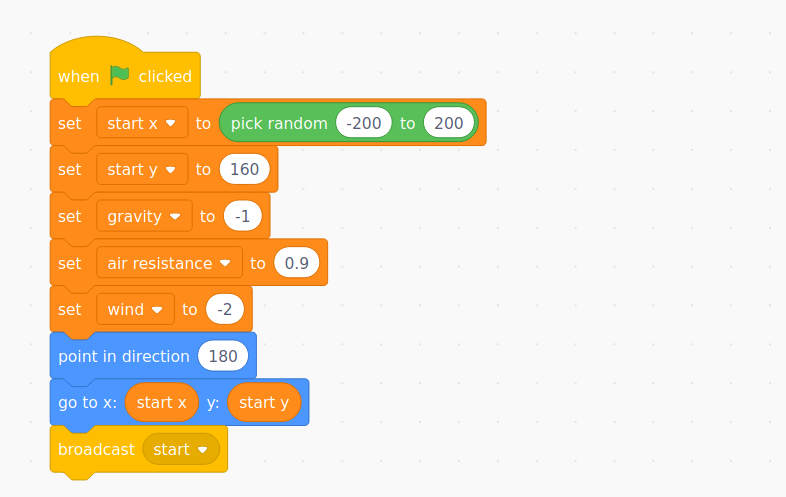
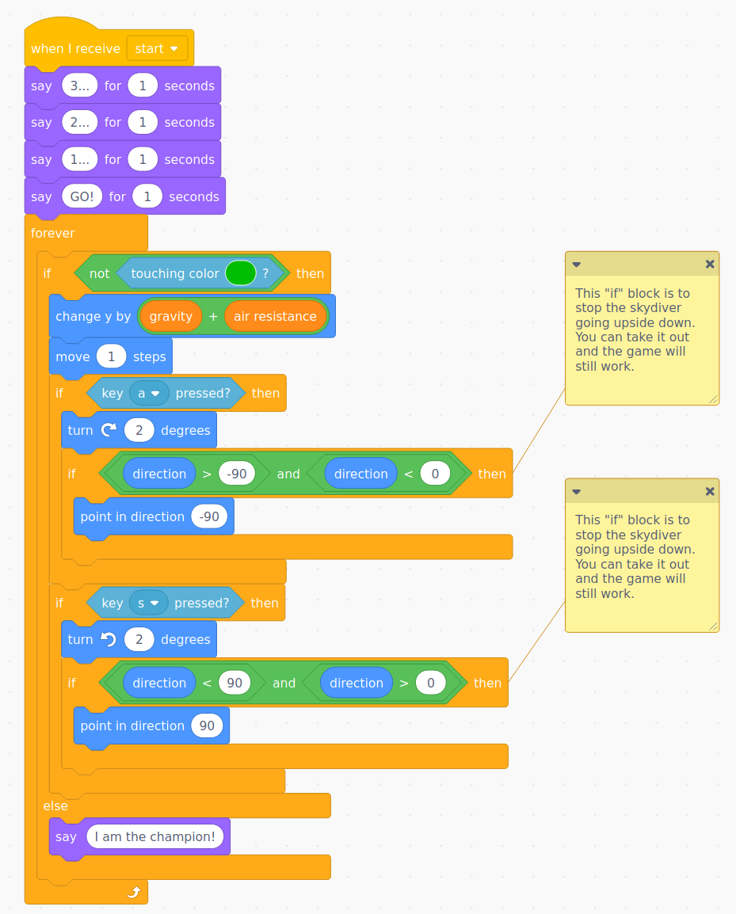
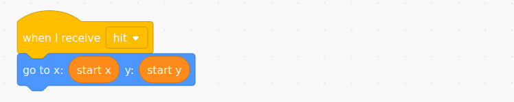
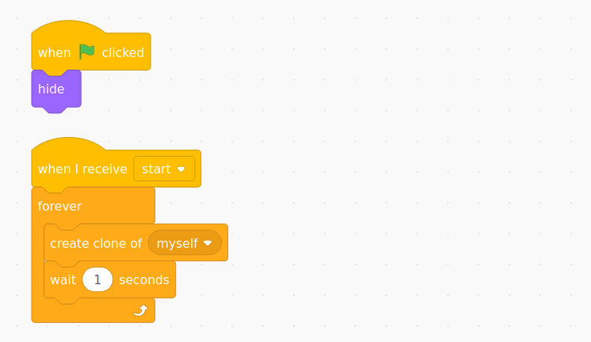
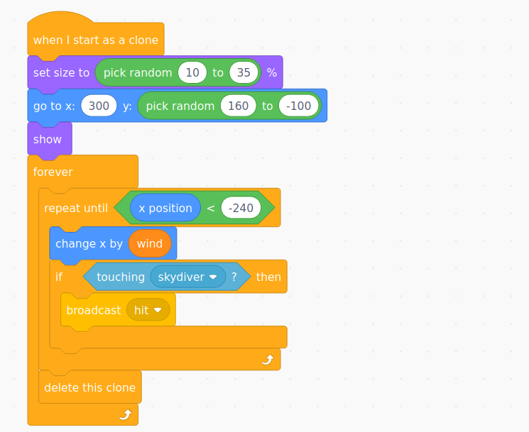

# {{title}}



In this project, children will make a game called Parachute Drop. The skydiver needs to get to the ground without hitting any of the clouds.

Children will review prior work on **variables**, and begin to explore how physical systems can be modelled in code. The variables are use here to model forces such as the air resistance and gravity, which act on the clouds and the skydiver. This project fits well with **work in science on forces**, and a science investigation into parachutes.

They will continue to use **selection** and will explore other ways that it is used, for example with **inputs** (i.e. `if key a is pressed then`), and begin to use it with **iteration** to position the clouds at the start of the game.

They will also look at x and y coordinates, although this work will be consolidated in other projects.

This project assumes a level of Scratch knowledge that builds on the knowledge covered in the Year 4 project, including how to create sprites and add code to them, how to create backgrounds, and how to load, save, and (if using Scratch accounts) remix projects shared via a studio. If children are saving work locally to their computers, then there will need to be a way to share a Scratch project with them.

### Suggested Session Breakdown

#### 4 - 5 sessions

The outline below is a very rough guide, and depends on learners being comfortable with logging in to Scratch, creating, saving programs, and using a class studio to find, remix and share projects.

| Session | Suggested Outline                                                                                                                                                                                  |
| ------- | -------------------------------------------------------------------------------------------------------------------------------------------------------------------------------------------------- |
| 1       | Showing the code and [predicting](#predict) what it does; [running](#run) the game; beginning paired work on commenting the code - predicting and running will need to run work in tandem          |
| 2       | Reviewing comments made last time; finishing commenting of code; guided/shared [investigation](#investigate) of code                                                                               |
| 3       | Beginning the [make](#make) stage; creating small steps of the code (e.g. making a sprite fall under gravity/air resistance, making a sprite turn, creating, moving and deleting clones in a loop) |
| 4       | Continuing the [make](#make) stage; designing original games on paper using the skills above; annotating with psuedo-code for key points                                                           |
| 5 - 6   | [Making](#make) and testing games; sharing to class studio; giving peer feedback; iterating on this process                                                                                        |

## Predict

First, children should have the opportunity to read the code. Remind children that code can be read as a story, they can step through it logically, one block at a time, and read it out loud. If they do this, it will almost always make sense.

First, the game itself looks like this - can anyone predict how it works or what the idea is?

Now, read and discuss the first part of the code.

This is the setup for the skydiver. What variables are set here? Look at the use of a `broadcast` block. Why is this here? (It broadcasts a message called "start" once the initial setup of the variables is completed. This message can the be received by the various sprites in the game. This is a common pattern that is used to ensure things like gravity, timers, lives, positions, etc are definitely set before sprites start to use them.)

Children should easily understand what the purple `say 3... (etc) for 1 seconds` blocks are doing, but may need to be guided to understand that they are there to allow the clouds time to fill the screen, otherwise the game is too easy. They will probably need to run the game to grasp this.

> Children may not have seen the combination of blocks `broadcast` and `when I recieve` before, and this pattern may need to be taught. These two blocks are used to send messages between sprites, for example, if the clouds here touch the skydiver, they broadcast a message which is received by the skydiver and returns him to his start position. Without this, the skydiver's code would have to check every single cloud one by one to see if he had hit them.

Next we have the code for controlling the skydiver. This should be more familiar to the children as it consists of nested `forever` and `if` blocks. Again, children should read and discuss this code, and speculate on what it does. Children should be comfortable with the way the key inputs are working to rotate the skydiver.

They should note the use of the `when I receive "start"` block at the top; this code will start running once everything is set up. Also, they should realise that the if block is checking to see if they are _not_ touching the ground (the green colour), and then moving the skydiver in this case (i.e. if the skydiver _is_ touching the ground, then he will stop moving and say "I am the champion!").

A subtle part of this code is the blue `move 1 steps` block. This is moving the skydiver in the direction the sprite is facing. Note the the sprite's costume is drawn rotated through 90&deg; and the setup code points the sprite in the direction 180&deg;. This is what allows the skydiver to fall with a combination of gravity and the direction he is pointing. Then, when a key is pressed to turn the sprite, an `if` block also checks whether the sprite is rotated outside of the range -90&deg; to +90&deg;, as the skydiver shouldn't be able to go up! This part is a bit tricky to understand, and it would be fine for children to just copy the blocks `if direction > -90 and direction < 0` and `if direction <90 and direction > 0`.

The final piece of code for the skydiver is simple, but children should discuss where the the "hit" message might be coming from. They should also notice that the original location of the skydiver was stored in the variables "start x" and "start y" in the set up code, so that he can be returned to the same start location if he hits a cloud.

Next, there is the code for the clouds.

First, the cloud sprite is hidden when the flag is clicked, then when the game starts, the sprite runs a `forever` loop that creates clones of the cloud every second.

> Children may not have seen the blocks for cloning a sprite, but these are very useful for creating lots of independent copies of a sprite, rather than having to make them all by hand. This is the beginning of _object oriented programming_, and is an important concept, but one that is not taught explicitly in KS2. However, children will be able to understand what is happening here, and why it is useful. We need an arbitrarily large number of cloud sprites, each moving across the screen, with their own random y co-ordinate, and their own x-coordinate that is updated based on the wind. These cloned sprites are controlled by the blocks below, under `went I start as a clone`.

Here, the code moves each newly created clone to a random y position, at x=300 (i.e off the right-hand edge of the screen). Then, in the `repeat` loop, each clone is moved across by updating its x position according to the `wind` variable, until the x position is less than -240 (i.e. the cloud is off the left edge). Note that some learners will need to be reminded or taught that, if `wind` is negative, then this is the same as subtracting from the x position.

The code also checks whether the cloud is touching the skydiver, and broadcasts the event `hit` if so. Finally, once the `repeat` loop finishes, the clone is deleted, otherwise all the old clouds will pile up on the left-hand edge of the stage.

## Run

Now, children can run the game and have a go. In the first instance, just allow them to play.

<iframe src="https://scratch.mit.edu/projects/444784774/embed" allowtransparency="true" width="485" height="402" frameborder="0" scrolling="no" allowfullscreen></iframe>

Next, children should **comment** the code. Assuming they have logged in to their scratch accounts, they should create a remix of the project, rename it (as something like "Parachute Drop Commented") and work from this.

Children should have some understanding of how to comment their code, and why this is important, Year 4 (i.e. it lets other programmers know what you were thinking when you made the code, and lets them see why your code is written the way it is. Even more important, it helps your memory. As programs get bigger and more complicated, you might not remember what each piece of code is doing when you come back to it next week, or even later in the same lesson).

There are already some comments on the code to show children which bit of the code are less important to the core functionality of the game - draw their attention to these parts,for example the code for stopping the skydiver rotating upside down. This will be an important teaching point later, but the game works without these `if` blocks, and children shouldn't get too hung up on what is happening here.

Children should write comments on the code to explain what each part does, paying particular attention to:

- What variables are being used? Where? What do they do in the code? What are they modelling?
- Where is selection being used (i.e. what `if` blocks are there)? What are these blocks doing?

## Investigate

Next, children should explore the code by changing it, again working from a "remix" of the project.

Initially, they can explore making changes to numbers, running the code, and seeing what happens. They should be taught to make a mental note of what a number was before they changed it, so that they can change it back. Then guide them to explore

- What happens when the `gravity` and `air` resistance are changed?
- What happens if we change the `wind` variable?
- Can they make clouds appear smaller of larger?
- What happens if we change the x and y coordinates of the where the clouds appear?
- Can children use their work from Year 4 to introduce "lives" to the game? Or a score for getting to the ground quicker?

## Make

As this is a fairly complex project for children in Year 5, it will be necessary to guide some small, key steps towards making their own games based on this project. Children will ultimately design their own games, but first, they will probably need to spend a session or so making the following discrete steps:

### The Skydiver

- Randomising a sprite's start position along the x-axis, and storing this in a variable
- Making a sprite based on gravity and air resistance, and storing these in variables, so that they can be changed (children could also create multiple sprites, for example a ball and a feather, that share a `gravity` variable, created with "for all sprites", but fall at different rates by having their own `air resistance` variables, created with "for this sprite only")
- Stopping a sprite when it hits the ground (i.e. making the sprite fall `if not touching the ground colour`)
- Turning a sprite using key presses in a forever loop. This step can be combined with the above, and children can see the need for an extra `move 1 steps` block.

### The Clouds

- Creating a sprite and hiding it and creating clones of it every 2 seconds
- Moving these clones to the far right of the screen, showing them and moving them across the screen by changing their `x position` by a `wind` variable
- Deleting them when they reach the other side
- Finally, creating a `hit` event that is `received` by the skydiver and send them back to `startx` and `starty`

Once the class are more comfortable with these small steps, and have made example code that they can refer to, then they can begin to design their own versions of the game, for example, guiding a flying squirrel to the ground without hitting the leaves, or landing a spaceship (children will need to create a planet that has an atmosphere - they can't have a variable called "air resistance" on the moon!).

These plans should be done on paper first, and children should annotate their work with "psuedo-code" (i.e. simple drawings of "Scratch-like" blocks that show roughly how things will be implemented). More able learners should also annotate where they will improve and extend the game, for example:

- Using timers, scores and lives (from Year 4 projects)
- Having a variety of "hazard" sprites (e.g. clouds, birds, etc) which push the player some steps, or send them back to the start
- Creating a two player version, where there are two "skydiver" sprites, which are controlled by two people, for example using "a" and "s" keys and "k" and "l" keys.

Once designing is complete, children should be giving ample time to create their games. They should be reminded not to spend all their time drawing sprites and backgrounds, but to work methodically on implementing the code in something like the order we practised together above. They should save their work often, and should test their work regularly and thoroughly. It's s a good idea to model this last point: children will often try to code and entire project in one go, press the green flag, and then be confused when it doesn't work. They should get into the habit of testing their work every few blocks.

As always, children should use the orange "share" button to share their work, adding a description and putting it in the class studio. They should be given time to play each others' games, give feedback, and respond to this. The more time that they can spend on this, the better their work will be.
